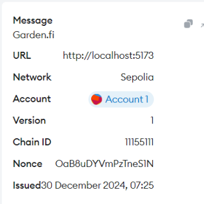
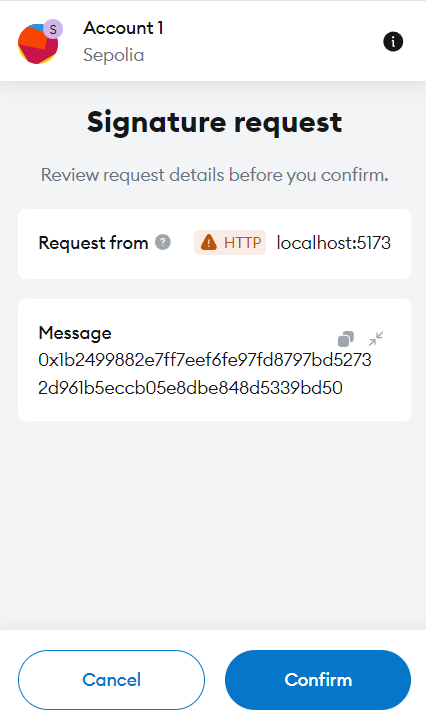

# API Demo App

:::note
This guide accompanies the [gardenfi/api-demo-dapp](https://github.com/catalogfi/api-demo-dapp) and is intended solely for learning purposes, and not for production use.
:::

## Introduction

This guide demonstrates how to use the [Garden API](../api/garden-api) to develop a basic dApp for swapping BTC (`testnet4`) to WBTC (`Ethereum Sepolia`). The user interface looks like this:


## Getting Started

1. Clone the repository:

   ```bash
   git clone https://github.com/catalogfi/api-demo-dapp.git
   cd api-demo-dapp
   ```

2. Install dependencies:

   ```bash
   npm install
   ```

3. Start the development server:

   ```bash
   npm run dev
   ```

4. Open your browser and navigate to `http://localhost:5173`.

## Authentication

The authentication section provides a detailed walkthrough of how to securely authenticate users using Garden’s Auth API, leveraging the Sign-In with Ethereum (`SIWE`) protocol. This method ensures seamless and trustless authentication without compromising user security. Below, we explain the flow of the authentication process and how each step guarantees integrity and security.

### Overview

The Auth API facilitates authentication by:

1. Generating a unique, one-time-use nonce as a challenge.
2. Allowing users to sign the nonce with their Ethereum wallet.
3. Verifying the signed message to confirm the user’s identity.

### Step-by-Step Flow

### 1. Requesting a nonce

The first step in the authentication flow is to generate a unique, single-use nonce for the client. The `/auth/nonce` responds with a unique nonce

```tsx
import axios from "axios";
import { API } from "../helpers/utils";

type APIResponse = {
   status: "Ok" | "Error",
   error?: string
}

async function GetNonce() {
   try{
      const { data } = await axios.get(`${API().orderbook}/auth/nonce`);
      return data.result;
   } catch (error) {
      console.log("Error fetching nonce:", error);
   }
}
```

### 2. Signing the nonce

Once the client receives the nonce, the user signs it with their Ethereum private key through their wallet. This step leverages the SIWE protocol to embed the nonce into a structured message containing metadata, such as domain and timestamp.

Example Message:



The signed message ensures that:

- The nonce is unique and prevents replay attacks.
- The user’s private key remains secure as it never leaves their wallet.

### 3. Verifying the signed message

The signed message is sent to `/auth/verify`, where the server validates the signature to confirm the user’s identity without accessing their private key. Upon successful verification, the server returns a JWT for subsequent authentication.

```tsx
import axios from "axios";
import { API } from "../helpers/utils";

async function VerifySIWE(message: string, signature: string, nonce: string) {
  const { data } = await axios.post(`${API().orderbook}/auth/verify`, {
    message: message,
    signature: signature,
    nonce: nonce,
  });
  return data.result;
}
```

## Order creation

The order creation process in Garden allows users to initiate `cross-chain swaps` using a seamless, secure, and trustless mechanism.

### Overview

When a user is ready to create an order, the process begins with retrieving a price quote based on the user’s selected order pair, which consists of the source chain, source asset, destination chain, destination asset, and the amount to be swapped. After receiving the quote, the user confirms the order by signing it through their wallet. The order is then attested by Garden's API and validated, followed by the final order creation via the `/gasless/order` endpoint.

### Step-by-Step Flow

### 1. Requesting a Quote

The first step in the order creation process is for the client to request a price quote from the /price endpoint. Based on the selected order pair (`source_chain:source_asset::destination_chain:destination_asset`, and `amount`), the API responds with the following details:

- **Input token price**
- **Output token price**
- **Array of quotes**

```tsx
import axios from "axios";
import { API } from "../helpers/utils";
import { useCallback } from "react";

type APIResponse = {
  status: "Ok" | "Error";
  error?: string;
};

type FetchQuoteResponse = APIResponse & {
  result: Quote;
};

// hardcoded for demonstration
const ASSETS = {
  fromChain: "bitcoin_testnet",
  toChain: "ethereum_sepolia",
  fromAsset: "primary",
  toAsset: "0x3c6a17b8cd92976d1d91e491c93c98cd81998265",
};

const fetchQuote = useCallback(async (): Promise<number | undefined> => {
  const orderPair = `${ASSETS.fromChain}:${ASSETS.fromAsset}::${ASSETS.toChain}:${ASSETS.toAsset}`;
  try {
    const { data } = await axios.get<FetchQuoteResponse>(
      `${API().quote}/price?order_pair=${orderPair}&amount=${decimalToBase(
        inAmount,
        8
      )}&exact_out=false`
    );

    if (data.status === "Ok") {
      setState((prev) => ({ ...prev, quote: data.result }));
      return Object.values(data.result.quotes)[0];
    }
  } catch (error) {
    handleError(error, "fetch quote");
  }
}, [inAmount, handleError]);
```

### 2. Signing the Order

Once the client has reviewed the quote, the user confirms the order by signing it using their wallet. This ensures that the order creation process is secure and the user is intentionally initiating the swap.

To confirm the order, the client signs the quote details using their wallet, which guarantees the legitimacy of the action and the user's consent to the swap.



### 3. Attesting the quote

- Once the quote is signed, the client sends it to the `/quote/attested` endpoint for Garden to attest the quote.
- Garden responds with an attested quote, which includes a `signature` that is used for further order creation.
- An attested quote signifies that the quote is valid until a specified `deadline`.

```tsx
import axios from "axios";
import { API } from "../helpers/utils";

type CreateOrderRequest = {
  source_chain: string;
  destination_chain: string;
  source_asset: string;
  destination_asset: string;
  initiator_source_address: string;
  initiator_destination_address: string;
  source_amount: string;
  destination_amount: string;
  fee: string;
  nonce: string;
  min_destination_confirmations: number;
  timelock: number;
  secret_hash: string;
};

export type APIResponse = {
  status: "Ok" | "Error";
  error?: string;
};

type AttestedQuoteResponse = APIResponse & {
  result: CreateOrderRequest & AdditionalData;
};

async function getAttestedQuote(
  apiUrl: string,
  order: CreateOrderRequest,
  strategy: string,
  refundAddress: string
): Promise<AttestedQuoteResponse> {
  const attestedQuoteReq: CreateOrderReqWithStrategyId = {
    ...order,
    additional_data: {
      strategy_id: strategy,
      bitcoin_optional_recipient: refundAddress,
    },
  };

  const { data: attestedQuoteRes } = await axios.post<AttestedQuoteResponse>(
    `${apiUrl}/quote/attested`,
    attestedQuoteReq
  );

  if (attestedQuoteRes.status === "Error") {
    throw new Error("Error getting attested quote");
  }

  return attestedQuoteRes;
}
```

### 4. Creating the Order

- The create order request includes the additional data from the attested quote, along with the previously prepared order details.
- This request is sent to the Garden to create the order. Upon success, the response contains the result, which includes the `order ID`.

```tsx
import {useCallback} from "react";
import axios from "axios";
import { API } from "../helpers/utils";

type OrderCountResponse = APIResponse & {
   result: number
}

const fetchUserOrderCount = useCallback(async (address: string): Promise<number> => {
   const auth_token = localStorage.getItem("auth_token");
   try {
      const { data } = await axios.get<OrderCountResponse>(
         `${API().orderbook}/orders/user/${address}/count`,
         {
            headers: { Authorization: `Bearer ${auth_token}` }
         }
      );
      return data.result;
   } catch (error) {
      handleError(error, "fetch user order count");
      return 0;
   }
}, [handleError]);

const computeSecretHash = useCallback(async (nonce: number) => {
   if (!evmAddress) throw new Error("No EVMAddress available");

   const messageBuf = Buffer.from('catalog.js' + nonce + evmAddress);
   const msg = sha256(with0x(messageBuf.toString('hex'))).slice(2);
   const signedMessage = await signMessageAsync({ message: with0x(msg) });
   const secretHash = trim0x(sha256(with0x(signedMessage)));

   return {
      secret: trim0x(signedMessage),
      secretHash
   };
}, [evmAddress, signMessageAsync]); 

const initiateSwap = useCallback(async () => {
  const authToken = localStorage.getItem("auth_token");

  if (!evmAddress || !quote || !refundAddress || !authToken) {
    setState((prev) => ({ ...prev, error: "Missing required data for swap" }));
    return;
  }

  setState((prev) => ({ ...prev, isLoading: true }));

  try {
      // Get strategy and quote amount
      const [strategy, quoteAmount] = Object.entries(quote.quotes)[0];
      // Generate order nonce and secret hash
      const orderCount = await fetchUserOrderCount(evmAddress);
      const uniqueNonce = orderCount + 1;
      const { secret, secretHash } = await computeSecretHash(uniqueNonce);

      // Store secret for later use
      // Consider using a more secure storage mechanism in practise
      localStorage.setItem("order_secret", secret);
      const inAmountBase = decimalToBase(inAmount, 8);

      // Prepare order request
      const order: CreateOrderRequest = {
         source_chain: ASSETS.fromChain,
         destination_chain: ASSETS.toChain,
         source_asset: ASSETS.fromAsset,
         destination_asset: ASSETS.toAsset,
         source_amount: inAmountBase.toString(),
         destination_amount: quoteAmount.toString(),
         initiator_source_address: "19ae..1047b6da07baffba21eea30e25a2bc6c697c71e",
         initiator_destination_address: evmAddress,
         secret_hash: secretHash,
         fee: "1",
         timelock: 288,
         nonce: uniqueNonce.toString(),
         min_destination_confirmations: 0,
      };

    // Use helper function to get attested quote
      const attestedQuoteRes = await getAttestedQuote(
         API().quote,
         order,
         strategy,
         refundAddress
      );

   // Create the final order
      const createOrderReq: CreateOrderRequestWithAdditinalData = {
      ...order,
      additional_data: attestedQuoteRes.result.additional_data,
      };

      const { data: createOrderRes } = await axios.post<CreateOrderResponse>(
         `${API().orderbook}/gasless/order`,
         createOrderReq,
         {
            headers: { Authorization: `Bearer ${authToken}` },
         }
      );

      if (!createOrderRes || createOrderRes.status === "Error") {
         throw new Error("Error creating swap order");
      }

      setState((prev) => ({
         ...prev,
         swapId: createOrderRes.result,
         isInitiated: true,
         error: null,
      }));
  } catch (error) {
   handleError(error, "initiate swap");
  } finally {
   setState((prev) => ({ ...prev, isLoading: false }));
  }
}, [
  evmAddress,
  quote,
  refundAddress,
  inAmount,
  computeSecretHash,
  fetchUserOrderCount,
  handleError,
]);
```

## Order Remeption

### Overview

The **order redemption** flow typically involves claiming the swapped assets on the destination chain after the swap order has been successfully initiated.

### Step-by-Step Flow

### 1. Pre-requisites for Redemption

- The swap must be complete on the source chain, and assets must be ready on the destination chain.
- The secret generated during order creation must be revealed.

### 2. Retrieving Order Details

- The application fetches the order using the swapId or transaction hash. This includes:
  - **Status of the Order**: Whether the assets are ready for redemption.
   ```tsx
   import {useCallback} from "react";
   import axios from "axios";
   import { API } from "../helpers/utils";

   const fetchOrder = useCallback(async () => {
      try {
         const { data } = await axios.get<FetchOrderResponse>(
            `${API().orderbook}/orders/id/${orderId}/matched`
         );
         if (data.status === "Ok") {
            setOrder(data.result);
            setError(null);
         } else {
            setError("Failed to fetch order details");
         }
      } catch (error) {
         setError("Failed to fetch order details");
      }
   }, [orderId]);
   ```
  - **Secret**: Used to verify that the order can only be redeemed by the user who initiated it.

### 3. Constructing the Redemption Request

To redeem the order

- The **secret** created during the order creation phase is sent along with the redemption request. This proves ownership and validates the right to claim the destination assets.
- Redemption details typically include:
  - **Order ID**
  - **Secret**
  - **Perform on** (e.g., [`Source`,`Destination`])

```tsx
import {useCallback} from "react";
import axios from "axios";
import { API } from "../helpers/utils";

const initiateRedeem = useCallback(async () => {
   const authToken = localStorage.getItem("auth_token");
   const orderSecret = localStorage.getItem("order_secret");
   if (!authToken || !orderSecret) {
      setError("Missing authentication or order secret");
      return;
   }
   setIsLoading(true);
   try {
      const redeemRequest: RedeemRequest = {
         order_id: orderId,
         secret: orderSecret,
         perform_on: "Destination"
      };
      const { data: redeemResponse } = await axios.post<RedeemResponse>(
         `${API().orderbook}/gasless/settlement`,
         redeemRequest,
         {
            headers: { Authorization: `Bearer ${authToken}` }
         }
      );
      if (!redeemResponse || redeemResponse.status === "Error") {
         throw new Error(redeemResponse?.error || "Failed to redeem");
      }
      setError(null);
   } catch (error) {
      setError("Failed to redeem");
   } finally {
      setIsLoading(false);
   }
}, [orderId]);
```

### 4. Sending the Redemption Request

- The redemption request is sent to the smart contract or relayer on the **destination chain** (e.g., Ethereum Sepolia).
- The request triggers a smart contract call that:
  - Verifies the provided `secret` matches the `secretHash` stored in the order.
  - Transfers the destination asset (e.g., WBTC) to the user's address.
  - Marks the order as redeemed, preventing duplicate redemptions.

  