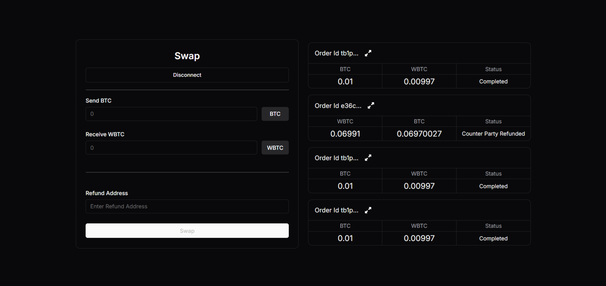

# API Demo App

:::note
This guide accompanies the [gardenfi/api-demo-dapp](https://github.com/catalogfi/api-demo-dapp) and is intended solely for learning purposes, and not for production use.
:::

## Introduction

This guide demonstrates how to use the [Garden API](../api/garden-api) to develop a basic dApp for swapping BTC (testnet4) to WBTC (ethereum sepolia).

The user interface looks like this:



## Getting Started

1. Clone the repository:
```bash
git clone https://github.com/catalogfi/api-demo-dapp.git
cd api-demo-dapp
```
2. Install dependencies:
```bash
npm install
```

3. Start the development server:
```bash
npm run dev
```

4. Open your browser and navigate to `http://localhost:5173`.